# WALKIES - Knocklyon

## Site Overview

WALKIES – Knocklyon is a registered charity run by volunteers to support the Senior neighbours of Knocklyon with their dog walking and pet care needs. Their office is based at the Leaf community centre and the catchment area for their services is a 5km radius around the heart of Knocklyon.

WALKIES – Knocklyon was founded on the belief that dog ownership provides great support and loving companionship to seniors, relieving feelings of loneliness and that dogs also provide many other health benefits to seniors like reducing stress, lowering blood pressure and increased social and physical interaction.

As well as dog walking services all year round or just during the winter months, WALKIES – Knocklyon also provides other services like trips to the vet, short-term fostering when needed, sourcing pet supplies, dog socialising, dog training and dog adoption. The charity also strives to provide tailored services for those seniors with other specific pet care needs. Their motto is HAPPY DOGS, HAPPY OWNERS.

## Target Audience:
- Primary audience: Senior neighbours of Knocklyon who currently own a dog or would like to adopt one.
- Secondary audience: Relatives, carers, and volunteers.

## Responsive Design:

The WALKIES - Knocklyon website was designed for good responsiveness on all screen sizes all the way down to 320px wide.

- Responsive design on MAC and iOS devices:

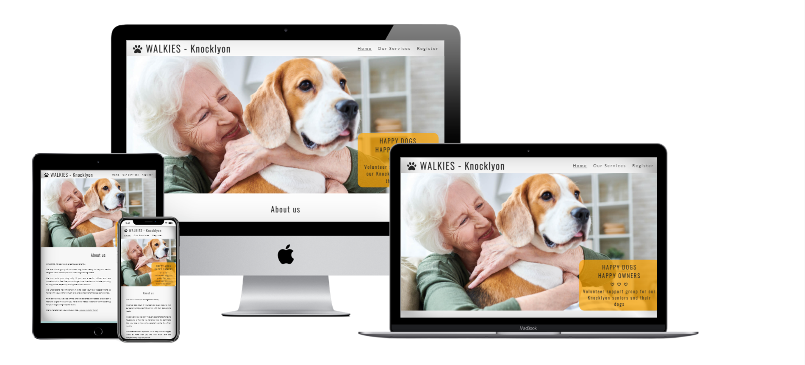

- Responsive design on PC and Android devices:

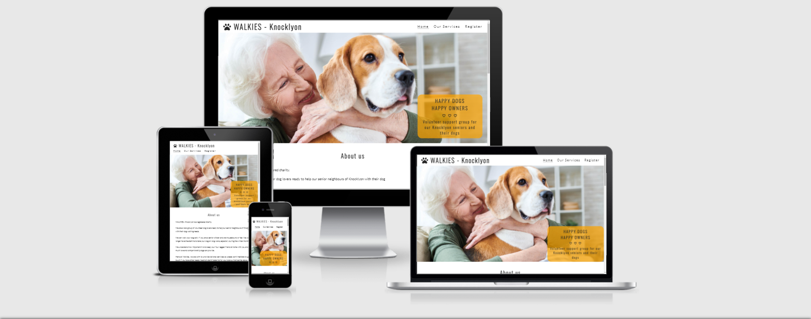

## Site Structure 

- This website is structured in three different pages: Home, Our Services and Register. 
- Users will be able to find all the information they need to know about the charity, their services, their contact details and how to register as a senior or as a volunteer using the appropriate form. 
- The website also contains information about the many benefits of dog ownership for seniors with a new top pick video every month. 
- There are also relevant announcements on all pages regarding the charity’s new launched newsletter, coffee morning meet ups, and offering help to senior neighbours of other areas to connect with their local support groups. 
- Finally, the Register page also includes information about how to donate and promotes the need for volunteers and the dog adoption services.

## Site Consistency and Design choices

- The consistency of the website is achieved through the regular use of the same header and footer across all pages.
- Other recurrent features are the use of round edged images across all pages, the regular use of solid font awesome icons and a clearly defined background colour palette composed of white, orange and a soft shade of blue-green.  
- Fonts are easy to read for the target audience and also consistent across the site with the use of Lato, sans serif in the body and Oswald, sans serif for all headers. Font colours are #2a2a2a and #252525 respectively which are both pleasant and easy to read dark greys.
- The simplicity of the design, easy readability and straightforward uncomplicated titles and content are adequate for the nature of this website and its target audience.
- The colour palette composed by white, orange, and a soft shade of blue-green, brings subtle and comforting colours to the website in order to satisfy the target audience.

## Features

### Logo 
- The WALKIES - Knocklyon logo features at the top left side of the screen in solid dark grey over a white background and includes a font awesome paw icon.
- The font used is Oswald, sans serif and the size starts with 280% for bigger screens down to 130% for smaller screens. 
- The logo has a purposely uncomplicated design and is easy to read as this is not a commercial website, but a charity's website and the target audience are seniors looking for a service.
- The logo also includes the location of this group, Knocklyon, as this is a local volunteer group targeting senior neighbours and volunteers of this specific neighbourhood.

### Navigation bar
- Featured on all three pages of the website, the navigation bar is placed aligned with the WALKIES logo and on the opposite side of the screen for desktop and laptop formats. 
- The bar is then pushed down to a left side position, placed just under the logo, for smaller screens.
- The navigation bar links to the Home, Services and Register pages and is identical on all three pages.
- This section allows users to navigate from page to page within the website easily without needing to revert back to previous pages using the back button.
- The active page appears underlined on the navigation bar for easy identification.

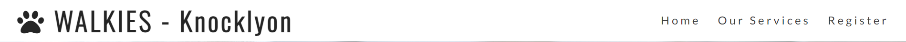

### Home page: The Landing page image

- The landing page image pictures a senior lady hugging a beagle dog portraying exactly what this website is all about.
- There is a zoom effect on the landing image every time the user clicks on the Home link of the navigation bar or on the actual logo. 
- An orange text box features at the bottom right corner of the landing image with the slogan of the charity "HAPPY DOGS, HAPPY OWNERS" and also reinforces the purpose and the target audience of the website.

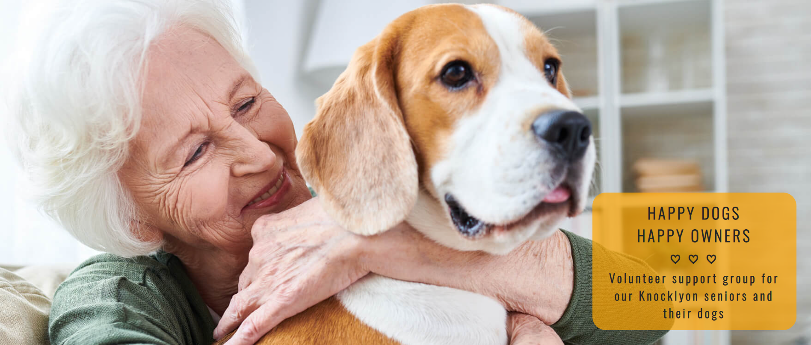

### Home page: About us section

- The About us section introduces WALKIES - Knocklyon, its nature, its purpose, the target audience and also gives an overview of the type of services offered.
- This section also includes a direct link to the register form available in the Register page.

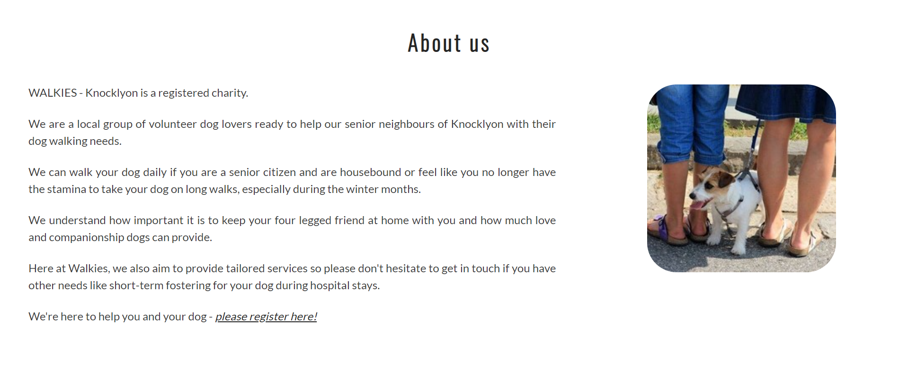

### Home page: The Benefits of Dogs for Seniors

- The Benefits section includes a list of the main benefits of dog ownership for seniors in terms of mental and also physical health.
- This section also includes three pictures of seniors spending time with their dogs.

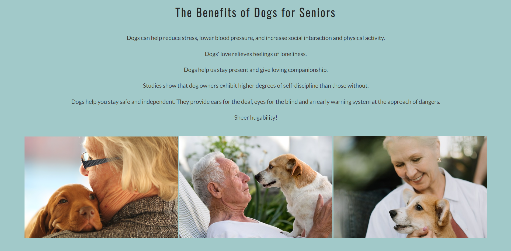

### Home page: Monthly top pick video (Watch our top pick February video!)

- This section includes a relevant monthly top pick video and the idea is that it will be updated monthly by the charity to add a bit of fun and novelty to the Home page.
- The February top pick video is a YouTube video called "10 Benefits for seniors owning a pet".

### Home page: Newsletter announcement box 

- There is an announcement box with an orange background at the bottom of every page of this website to bring some consistency to the site as a whole.
- The Home page announcement concerns the new newsletter which will be launched in March.
- This section also includes a direct link to the register form in the Register page.

### Footer

- The Footer section is the same across all three pages on the website adding to the feeling of consistency.
- This section includes the Registered Charity number, physical address, phone number and email address. The senior target audience is more likely to call or send an email rather than using social media. 
- This section also includes links to all the relevant social media pages for WALKIES - Knocklyon. The social media links will be valuable for some of the seniors who use social media, for other family members and carers and for volunteers.

### Our Services page: Services section

- This is the first section in the Our Services page and includes a photo gallery picturing some of the services offered.
- It also includes a list with the main services offered by the charity.

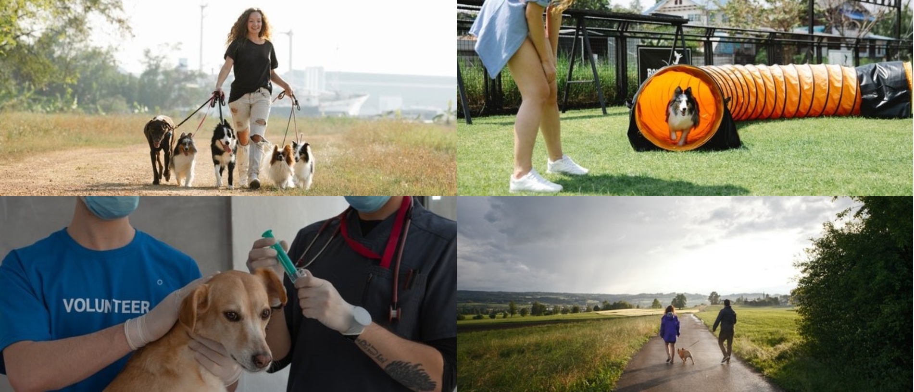

### Our Services page: Tailored services

- This is the section placed just under the main services list and its goal is to make a point about the flexibility of the services offered and to encourage seniors with different needs to get in touch.
- The header of this section is a h3 as it can be considered as an add-up to the services section above which has a h2 header.

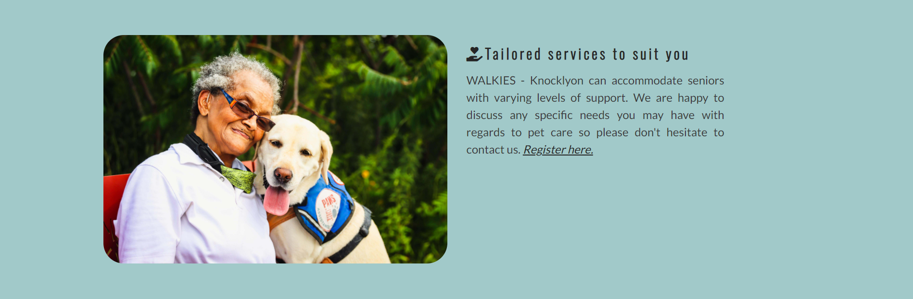

### Our Services page: Area covered

- The Area covered section includes a Google maps iframe of Knocklyon with a red pin placed right in the centre of Knocklyon.
- This section also includes a mention regarding the radius of the catchment area.

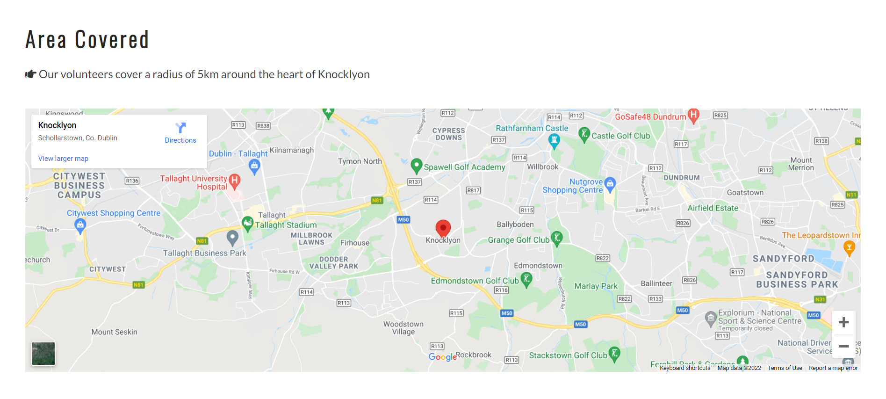

### Our Services page: Outside of catchment area announcement box

- Following the same layout as the other two pages in the website, the Our Services page ends with an announcement box with an orange background placed just above the footer.
- This section informs seniors from outside the catchment area that the charity will strive to help them connect with their local help groups.

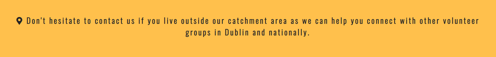

### Register page: Register form 

- The Register form allows users to register. Users will have to select a specific radio button depending on whether they are seniors looking to use the services or if they wish to register as volunteers.
- Users will be asked to enter their first name, last name, and email address which are all required fields.
- Users can also enter any additional information via a free text box.
- The form is placed on the left side of the screen over a background image of a Collie dog being lead walked.
- The form uses a post method and data is sent to the Code Institute's form dump URL.

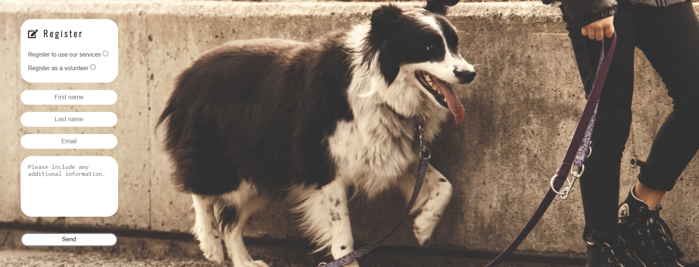

### Register page: Register more section, Donate, Volunteer, and Adopt.

- This section is placed just under the register form and contains three sub-sections, Donate, Volunteer and Adopt.
- This section aims to provide further information to users highlighting the fact that donations and volunteers are critical for the running of the charity and also presenting the Adoption service as an option for seniors who would do not currently own a dog and would still like to register.
- The Donate sub-section includes a link to a relevant funding page.
- The Volunteer and Adopt sub-sections both include direct links to the register form above.

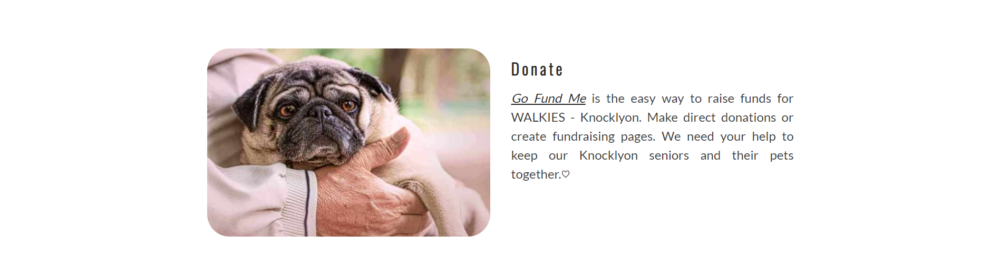
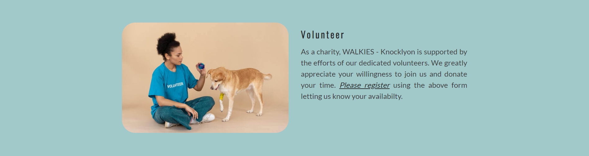
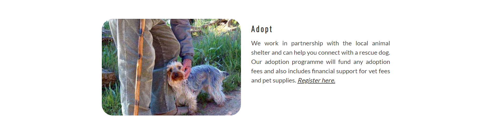

### Register page: Coffee mornings announcement box

- Following the same structure across the website, the last section of the Register page, just above the footer, is an orange announcement box informing users that coffee mornings will restart soon.

### Features to implement in the future

- As the WALKIES network develops in Dublin and nationally, a future improvement could be adding a section with links to the charity's partner branches in the register section. 
- As the project of the Newsletter develops, an idea would be to create a fourth page called News to feature all the newsletters published so far and including the testimonials from seniors and volunteers.
- Finally another future project would be the creation of a Resources page to include links to interesting articles and websites regarding pet care, best pets for seniors, information about local groomers, vets, or even pet-friendly care homes, to name a few.

## Testing

### Manual Testing
- I used Edge, Chrome and Firefox desktop browsers to ensure cross-compatibility. 
- I used DevTools to simulate different smaller screen sizes down to 320px in width as well as testing on several personal devices including Android tablets and mobile phones.
- I asked my mentor and friends and relatives to test the website on Opera and iOS and no errors were reported.
- I asked my network to test the functionality of the website on their devices, to check every image and click on every link, to try out the navigation bar redirects, to complete the register form, and to also check for typos, etc. No errors were reported.

### Issues and Fixes
1. Intended Outcome: A balanced Services section with a list of services offered and some relevant photos
   - Issue: To begin with I had a photo gallery of eight photos in this section which was too big and imposing and was taking the attention away from the services list. 
   - Solution: I selected the four most relevant photos and reduced the size and height of the gallery to bring more attention to the actual Services list. The photos may be relevant and have their place in this section, but the Services list is essential for the target audience so this brings a more balanced viewing / reading to this section. 

2. Intended outcome: A relevant hero image was crucial for the website as the image on the landing page is the first impression of the website which cannot be undone. The hero image has to speak for itself as an image is worth more than a thousand words and by seeing it users get a general idea of what the website is all about.
   - Issue: I was only able to find images of seniors with dogs which format was not suitable for the wide horizontal hero image format that I wanted to achieve so I settled for a placeholder photo of a sausage dog wearing a harness and on the lead. Although the image was stunning and relevant in the way that the dog was being walked and this website is offering dog walking services, it still didn't transmit the purpose of the charity and how it aims to help seniors.
   - Solution: I kept looking until I found a suitable image which transmits what the website is about. I replaced the hero image a few weeks into the project with an image portraying a senior lady hugging her dog.

3. Intended outcome: Clear visibility of links across the website.
    - Issue: Some of the feedback I got from my network is that the direct links to the register form from other sections (e.g. from the Newsletter section) were not clearly visible as neither was the link to the GoFundMe page from the Donate section. The links were emphasized and were underlined on hover but were not visible at first sight and could be missed.
    - Fix: Using the same colour palette of the website I used a different font colour (white and orange) depending on the background colour (e.g. white over orange and orange over white).
    - Refix: My mentor advised me to reset the font-colour of every hypertext to the original dark grey after checking with an accessibility tool, as accessibility scored low and the target audience is prone to have eyesight issues. I underlined every hypertext instead to make them stand out from the rest of the text and I also increased the font-size to 105% on hover to give a feeling of movement but without using JavaScript.

4. Intended outcome: Centre the About us section image in its div
    - Issue: The div containing the image floats right and the image itself was not centred in the div. The text-align, align-items and text-align attributes were not achieving the desired outcome.
    - Fix: I found the answer in the "Love Running" project provided by the Code Institute and achieved the desired result by setting the margin to 0 auto.

5. Intended outcome: Website elements optimised scaling depending on browser's settings.
    - Issue: Some of the feedback I received from my mentor was to avoid the use of pixels as a unit as much as possible as rem allows for optimised scalability depending on a user's browser settings.
    - Solution: I converted most of the pixels into rem measures with some exceptions like image sizes.

6. Intended outcome: A Services-more section which includes the divs Donate, Volunteer and Adopt and that is clear of other sections.
    - Issue: Before I included the announcement box at the bottom of this section, services-more was directly over the footer and the social media icons kept overlapping with it. After checking on DevTools I realised that only a small part at the top of the register-more section was highlighted when I hovered over it. 
    - Fix: I researched how to include all of the divs inside the section. The three divs were inside the section tags and the height of the section was set to auto, but I found out that because all of the divs had floating elements I had to include a last div within the section as a clearing element before I ended the section and style it in CSS (clear: both). I found the answer in the Stackoverflow website as credited below. After doing this the height of the section was highlighted as it was intended in the DevTools and the footer was no longer overlapping. I used this technique again in the About us and Tailored services sections by creating a class id="clear".

7. Intended outcome: Hide one of the silhouette icons which are part of the Our Services header in screens 500px and under.
    - Issue: When using DevTools to test for small screens I realised that the black silhouette icon to the right of the Our Services header was pushed under the header. 
    - Fix: I researched how to hide an image in responsive design using CSS (display: none). I found the answer in the sitewizard website as credited below. I used the same technique to hide the subtitle of the Hero image cover text box for smaller screens of 500px and under. This way on small screens the only cover text displaying is "HAPPY DOGS, HAPPY OWNERS".

8. Intended outcome: Achieve high Performance score in Lighthouse for all screen sizes.
    - Issue: When first testing in Lighthouse my performance scores were all over 90 for desktop but went down considerably when testing for mobile sizes.
    - Fix: Resize images using the simpleimageresizer.com website and then compress them further with TinyPNG.com. (The Register page performance score for mobile is the only score now falling under 90. After compressing the images extensively I decided to settle for an 89 score for mobile as seen in the screenshot below. The performance of the same Register page on Desktop is 99 as also shown below.)

9. Intended outcome: Achieve higher Accessibility score in Lighthouse for the Register page.
    - Issue: As realised testing with Lighthouse, the "volunteer" id was not unique as I had used it twice in register.html.
    - Fix: I gave the label in the register form a new "volunteer-reg" id.

### Unfixed issues

1. Intended outcome: Have a high Best Practices score in all three pages.
   - Issue: When using Lighthouse I realised that the index.html page had a score of 92 in Best Practices while my other two pages had a score of 100. The issue type in Lighthouse was a "SameSite cookie" issue. I narrowed down the issue to a YouTube iframe as the Best Practices score went up to 100 if the video section was commented out.
   - Fix: I sought advice in the Project Portfolio1 Slack channel and one of the mentors mentioned that this was a server side issue so out of my control. The 92 score is acceptable so I have decided it to keep the iframe as it brings an interesting feature to the website. Also if I test the index.html page with Lighthouse via an incognito browser window, then I get 100 in Best Practices as there is no interference with browser extensions so this issue may be a "non-issue" after all.

2. Intended outcome: Shorter and more efficient CSS code.
   - Issue: My CSS code has no errors and has passed validation. However, after learning many CSS best practices during the course of this project, I now realise that I could have made a better use of classes instead of targeting some recurrent elements by id.
   - Fix: If I had to start this portfolio project from scratch, I would reorganise some ids into classes in order to have a simplified CSS code (e.g. most h2 headers have the same font colour and size so a header class could have been used).

3. Intended outcome: No tapping issues on mobile devices.
   - Issue: Lighthouse flagged a potential tapping issue as the menu tabs would be very close together for really small screens.
   - Fix: After testing on multiple mobile devices and asking my network to do the same, no issues were reported and there doesn't seem to be any tapping issues. Menu bar tapping is perfectly functional and menu bar items stay aligned on all screen sizes down to 314px wide. The tapping issue only seems to occur when the menu items are pushed one under the other for screens under 314px in width, but as disclaimed above this website has been designed to be functional for all screen sizes down to 320px in width.

### Post Development Testing

- HTML Validator: https://validator.w3.org/nu/
  - Issue found: Stray end of div in register.html
    - The solution was simply to locate and remove the stray end of div
  - Issue found: The services gallery section needed a header (yellow warning)
    - The solution I used was turning the services gallery and the services list into two divs instead of sections and I then placing them inside the same section called Services which has a h2 header.
  - All three pages are now fully validated and have no HTML errors.
  
- CSS Validator: https://jigsaw.w3.org/css-validator/
    - The CSS code was validated as CSS Level3 +SVG with no errors found.
    

        
    

     
     
### Lighthouse Score

Test conditions:
- All lighthouse tests were carried out in incognito mode to avoid interference from browser extensions.
- All tests were run for both mobile and desktop.
- The scores shown are the final scores after fixing the issues mentioned in the "Issues and Fixes" section above.

Lighthouse Scores for Desktop: 

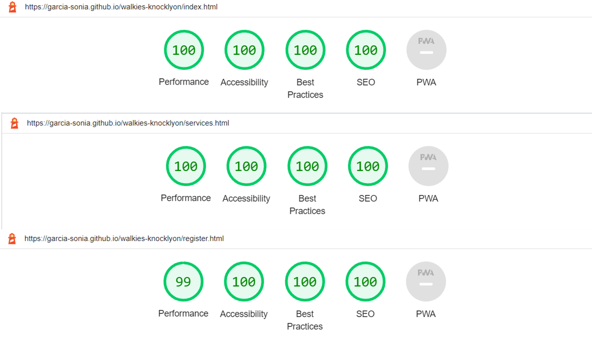

Lighthouse Scores for Mobile: 

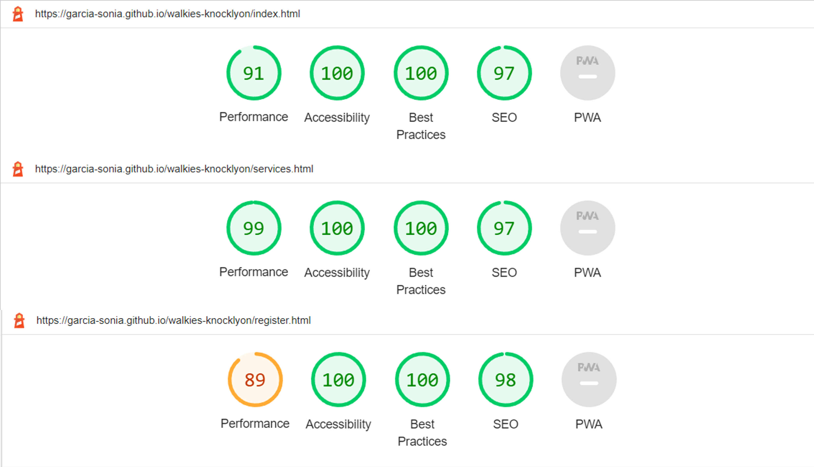

## Deployment 

This website was deployed using [GitHub Pages](https://pages.github.com/) following the below procedure:
  1. From the [project's repository](https://github.com/garcia-sonia/walkies-knocklyon), click on the Settings tab located in the top navigation bar.
  2. From the left-hand menu, select the Pages tab.
  3. Under the Source section, select the Main branch from the drop-down menu and click Save.
  4. A message will be displayed to indicate a successful deployment to GitHub pages and provide the live link.

You can find the live site via the following URL - [WALKIES - Knocklyon](https://garcia-sonia.github.io/walkies-knocklyon/)

## Credits

### Technical reference

First of all, I would like to thank my Mentor from Code Institute [Richard Wells](https://github.com/D0nni387) for all his help and good advice throughout this project Portfolio.

The project was influenced by the Code Institute's code along project called "Love Running" where I took inspiration for the placement of the logo, navigation bar and hero image with a zoom effect.

For the rest of the code I relied mainly upon W3schools and used stack overflow and thesitewizard to fix two of the bugs as already mentioned in the Issues and fixes section.

- [CSS Section Automatically Adjust Height?](https://stackoverflow.com/questions/10196206/css-section-automatically-adjust-height) - Stackoverflow - Answer provided by D.J. MacFarlane

- [How to Hide Images on a Website When It is Viewed on a Mobile Phone](https://www.thesitewizard.com/css/hide-images-on-mobile-website.shtml) - Thesitewizard.com

Last but not least I would like to thank:
- [Simen Daehlin](https://github.com/Eventyret) for being so helpful and answering my questions promptly on the Project portfolio1 Code Institute's Slack channel.
- [David Bowers](https://github.com/dnlbowers) for taking inspiration on the Readme file he prepared in the context of his [Modern Budhism](https://github.com/dnlbowers/modern-buddhism/blob/main/README.md) project Portfolio.
- [Dilner1](https://github.com/dilner1) for taking inspiration on the way sections are divided in his [Studio6](https://dilner1.github.io/Studio-Six/) project Portfolio.

### Content inspiration

All content in the WALKIES - Knocklyon website was written by myself. I looked at the websites below for ideas and inspiration.

- [Aging Care - Article: The Healing power of pets for seniors by B. Ballinger](https://www.agingcare.com/articles/benefits-of-elderly-owning-pets-113294.htm)

- [AARP - Article by C. Cheakalos: Ten reasons to get a dog when you're over 50](https://www.aarp.org/home-family/friends-family/info-2014/dog-owners-health-life-benefits-photo.html#slide3)

- [DSPCA](https://www.dspca.ie/)

- [Home Care Assistance Blog](https://homecareassistance.com/blog/benefits-of-pets-for-seniors)

- [Pets for the elderly](https://www.petsfortheelderly.org/our-partners/participating-shelters.php)

- [The Cinnamon Trust](https://cinnamon.org.uk/home/)

### Media

Hero image in landing page (licence acquired)- [iStockPhoto - Photo by SeventyFour](https://www.istockphoto.com/photo/happy-granny-loving-her-dog-gm950847190-259549163)

About us image - [Pxhere.com - by unknown camera](https://pxhere.com/en/photo/914261)

Senior1 (Benefits) (licence acquired) - [Adove Stock - by Budimir Jevtic](https://stock.adobe.com/ie/images/old-man-and-cute-dog-kissing/158731172)

Senior2 (Benefits) - [Maxpixel.net - by Canon EOS 600d](https://www.maxpixel.net/Hug-Woman-Cute-Dog-Old-Love-Young-Vizsla-Puppy-1835731)

Senior3 (Benefits) - [Pexels.com - Photo by Cottonbro](https://www.pexels.com/photo/smiling-elderly-woman-holding-her-pet-5961937/)

Senior4 (Donate) - [Pixabay - Photo by winterseitler ](https://pixabay.com/photos/old-man-pug-park-dog-character-2090377/)

Senior5 (Adopt) - [Pixabay - Photo by JosepMonter](https://pixabay.com/photos/men-old-man-dog-love-person-2126859/)

Senior6 (Tailored services) - [Pexels.com - by Provisionshots](https://www.pexels.com/photo/man-love-people-summer-10923964/)

Images used for the gallery in Our Services page:

 - Dog walker - [Pexels.com - Photo by Blue bird](https://www.pexels.com/photo/a-woman-walking-a-group-of-dogs-7210537/)
 - Dog agility traning - [Pexels.com - Photo by Blue bird](https://www.pexels.com/photo/woman-looking-at-dog-running-through-playing-tunnel-7210258/)
 - Vet - [Pexels.com - Photo by Mikhail Nilov](https://www.pexels.com/photo/woman-in-blue-crew-neck-t-shirt-holding-white-and-brown-short-coated-medium-sized-dog-7474856/)
 - walkers-275 [Pexels.com - Photo by Jonas Mohamadi](https://www.pexels.com/photo/man-and-woman-walking-dog-on-tarmacked-road-2495563/)

Register form - [Pexels.com - Photo by lum3n](https://www.pexels.com/photo/person-holding-pet-dog-leash-while-standing-on-concrete-road-237692/)

Volunteer girl - [Pexels.com - Photo by Mikhail Nilov](https://www.pexels.com/photo/a-woman-sitting-on-the-floor-7474086/)

Silhouette of couple walking their dog [Iconspng.com](https://www.iconspng.com/image/100077/couple-walking-their-dogs-silhouette)

Silhouette of woman walking dog [Pngkey.com](https://www.pngkey.com/detail/u2q8w7t4t4a9o0i1_silhouette-walking-dog-women-people-full-people-silhouette/)

YouTube video on Home page [10 Benefits of Seniors owning a pet - by Nurse next door](https://www.youtube.com/watch?v=-SSb4-G_SGg)

### Oher tools and resources

- Icons in the logo, footer and other sections across the website were taken from [Font Awesome](https://fontawesome.com/)
- All fonts were imported from [Google fonts](https://fonts.google.com/)
- Images were resized using [Simple Image Resizer](http://www.simpleimageresizer.com/upload)
- Images were compressed using [Tiny png](https://tinypng.com/)
- Mockups for MAC were taken using [Techsini](http://techsini.com/multi-mockup/)
- Mockups for PC/Android were taken using [Am I Responsive](http://ami.responsivedesign.is/)
- Website was tested with [Chrome DevTools](https://developer.chrome.com/docs/devtools/) and [Lighthouse](https://chrome.google.com/webstore/detail/lighthouse/blipmdconlkpinefehnmjammfjpmpbjk?hl=en)

