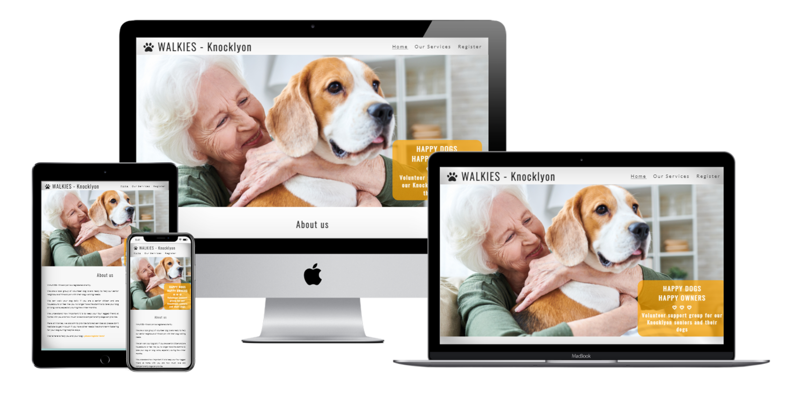
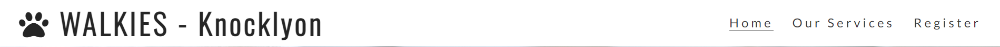
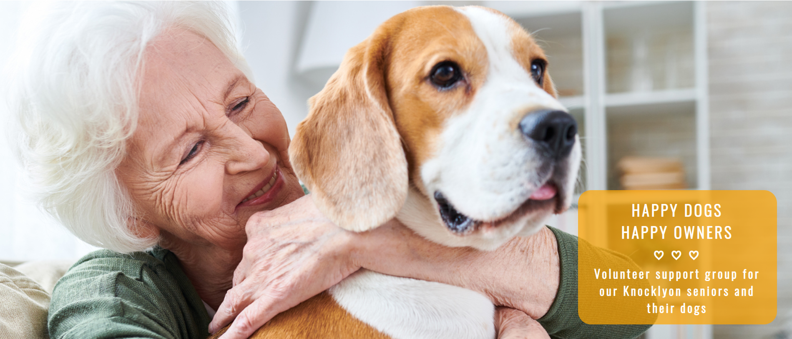
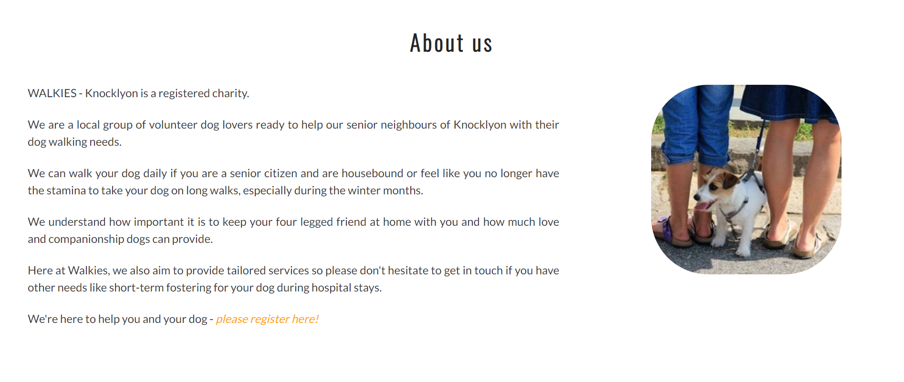
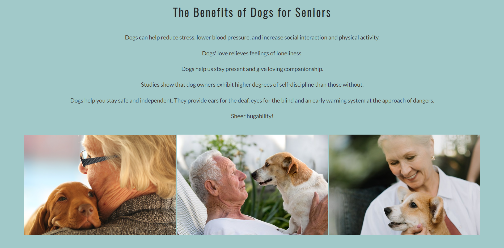

# WALKIES - Knocklyon

WALKIES – Knocklyon is a registered charity run by volunteers to support the Senior neighbours of Knocklyon with their dog walking and pet care needs. Their office is based at the Leaf community centre and the catchment area for their services is a 5km radius around the heart of Knocklyon.
WALKIES – Knocklyon was founded on the belief that dog ownership provides great support and loving companionship to seniors, relieving feelings of loneliness and that dogs also provide many other health benefits to seniors like reducing stress, lowering blood pressure and increase social and physical interaction.
As well as dog walking services all year round or just during the winter months, WALKIES – Knocklyon also provides other services like trips to the vet, short-term fostering when needed, sourcing pet supplies, dog socialising, dog training and dog adoption. The charity also strives to provide tailored services for those seniors with other specific pet care needs. Their motto is HAPPY DOGS, HAPPY OWNERS.
This website is structured in three different pages: Home, Our Services and Register. Users will be able to find all the information they need to know about the charity, their services, their contact details and how to register as a senior or as a volunteer using the appropriate form. The website also contains information about the many benefits of dog ownership for seniors with a new top pick video every month. There are also relevant announcements on all pages regarding the charity’s new launched newsletter, coffee morning meet ups, and offering help to senior neighbours of other areas to connect with their local support groups. Finally, the Register page also includes information about how to donate and promotes the need for volunteers and the dog adoption services.

## Features

### Logo 
The WALKIES - Knocklyon logo features at the top left side of the screen in solid black over a white background and includes a font awesome paw icon. The font used is Oswald, sans serif and the size starts with 280% for bigger screens down to 130% for smaller screens. The logo has a purposely uncomplicated design and is easy to read as this is not a commercial website but a charity's website and the target audience are seniors looking for a service. The logo also includes the location of this group, Knocklyon, as this is a local volunteer group targetting senior neighbours and volunteers of this specific neighbourhood.

### Navigation bar
Featured on all three pages of the website, the navigation bar is placed aligned with the WALKIES logo and on the opposite side of the screen for desktop and laptop formats. The bar is then pushed down to a left side position, placed just under the logo, for smaller screens.
The navigation bar links to the Home, Services and Register pages and is identical in all three pages.
This section allows users to navigate from page to page within the website easily without needing to revert back to previous pages using the back button.
The active page appears underlined on the navigation bar for easy identification.

### The Landing page image

The landing page image pictures a senior lady hugging a beagle dog portraying exactly what this website is all about.
There is a zoom effect on the landing image every time the user clicks on the Home link of the navigation bar or on the actual logo. 
An orange text box features at the bottom right corner of the landing image with the slogan of the charity "HAPPY DOGS, HAPPY OWNERS" and also reinforces the purpose and the target audience of the website.

### About us section

The About us section introduces WALKIES - Knoclyon, its nature, its purpose, the target audience and also gives an overview of the type of services offered.
This section also includes a direct link to the register form available in the Register page.

### The Benefits of Dogs for Seniors

The Benefits section includes a list of the main benefits of dog ownership for seniors in terms of mental and also physical health.
This section also includes three pictures of seniors spending time with their dogs.

### Monthly top pick video (Watch our top pick February video!)

This section includes a relevant monthly top pick video and the idea is that it will be updated monthly by the charity to add a bit of fun and novelty to the Home page.
The February top pick video is a YouTube video called "10 Benefits for seniors owning a pet".

### Newsletter announcement box 

There is an announcemnt box with an orange background at the bottom of every page of this website to bring some consistentcy to the site as a whole.
The Home page announcement concerns the new newsletter which will be launched in March.
This section also includes a direct link to the register form in the Register page.

### Footer

The Footer section is the same accross all three pages in the website adding to the feeling of consistency.
This section includes the Registered Charity number, physical address, phone number and email address. The senior target audience is more likely to call or send an email rather than than using social media. 
This section also includes links to all the relevant social media pages for WALKIES - Knocklyon. The social media links will be valuable for some of the seniors who use social media, for other family members and carers and for volunteers.

